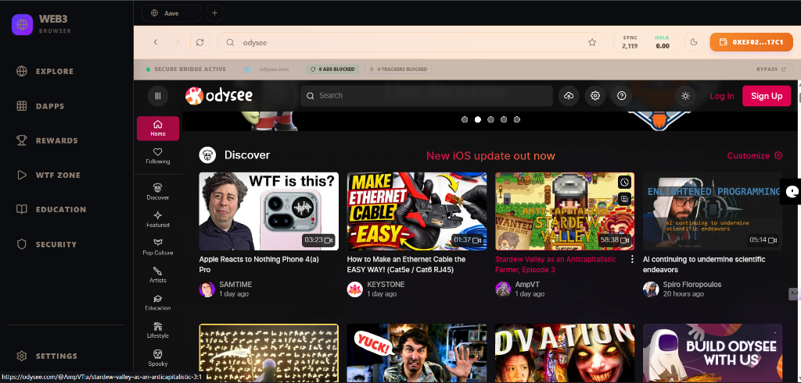
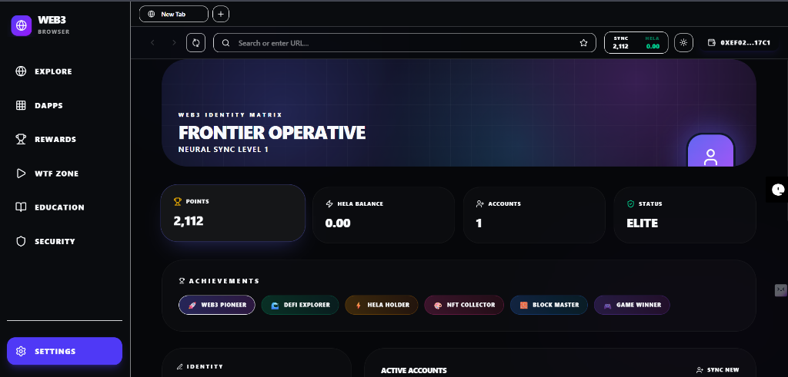

# 🌐 Web3 Browser Platform - Backend Engine

The powerful Python-based backend server powering the Web3 Browser platform. This intelligence layer manages decentralized user identities (neural signatures), orchestrates gamified reward systems, indexes decentralized applications (dApps), and provides a secure search functionality to prevent cross-origin breaches.

## 🚀 Product Overview
**What is your dApp about?**
The powerful Python-based backend server powering the Web3 Browser platform. This intelligence layer manages decentralized user identities (neural signatures), orchestrates gamified reward systems, indexes decentralized applications (dApps), and provides a secure search functionality to prevent cross-origin breaches.

**What problem are you solving?**
The steep learning curve and security risks associated with Web3. Our backend acts as a protective, educational gateway that maintains the state of a user's progress, validating and issuing rewards to prevent exploitation while keeping users securely sandboxed.

---

## 🎯 Use Case
**Who is this product built for?**
- Web2 users exploring Web3 for the first time.
- Users looking to securely onboard and manage their decentralized identity.
- Individuals looking to earn crypto rewards through onboarding quests securely.

**Why does this matter for users?**
It provides a secure, trustworthy environment where users are rewarded for learning. By validating interactions server-side, it prevents malicious exploits of the reward system and ensures a fair, technically empowering, and financially self-sovereign community.

---

## 📸 Screenshots

<div align="center">
  
  
  
  
</div>

---

## 🏗️ Architecture
**How does your product work?**
1. **User Registration**: When a user connects their wallet on the frontend, the backend registers the address, assigning them an internal ID and initiating their points balance.
2. **Activity Tracking**: As the user explores the decentralized web or completes "WTF Quests", the frontend pings the `/rewards/claim` endpoint. The backend processes the activity type and increments the user's score up to predefined daily caps.
3. **Redemption Matrix**: When a user accumulates over 1,000 internal points, they can execute a redemption. The backend deducts the internal points and orchestrates the conversion to equivalent "Hela Tokens".
4. **Search and Validation**: The backend provides suggestion endpoints and acts as an indexer.

**What components are involved?**
Built with **Flask** and **SQLAlchemy**, designed as a lightweight, robust JSON API.
- **`app.py` & `routes/`**: Main Flask application and API Endpoints (users, rewards, search).
- **`models/`**: Database schema definitions (User profiles, Gamification logging).
- **`services/hela_engine.py`**: Smart contract interaction handlers for the Hela Network.

---

## 🔗 HeLa Integration
**How is your dApp leveraging the HeLa Network?**
The platform integrates directly with the **Hela Network**. The backend tracks aggregate educational and browsing points locally, and handles the cryptographic logic when a user opts to sync (redeem) their points for on-chain assets. It orchestrates the distribution of the native HLUSD token directly to the user's connected wallet on the Hela Testnet.

### Deployed Contract Details (Hela Testnet)
- **Token / Contract Address**: `0xBE75FDe9DeDe700635E3dDBe7e29b5db1A76C125`

**Proof of Transactions (Tx Hashes):**
1. `0x189b830b54a34d492d1ba594211f9bb7a54f853dda5cae343b89cb7acd9dc987`
2. `0x661e041ea358d82da5d8ea2fdf37f7bea92370fce6a6f7ae880244abee42b7c2`
3. `0xe80ffdf3b88357dd5490f63ac42a457be69b749168ddc742abd3baf96f51ed9e`

---

## 💻 Setup & Installation

To run the backend locally:

1. **Clone the repository:**
   ```bash
   git clone https://github.com/Apoorv-sharma1/web3browser_backend.git
   cd web3browser_backend
   ```

2. **Create a Virtual Environment (Recommended):**
   ```bash
   python -m venv venv
   source venv/bin/activate  # On Windows use: venv\Scripts\activate
   ```

3. **Install Dependencies:**
   ```bash
   pip install -r requirements.txt
   ```

4. **Initialize Environment Variables:**
   Copy `.env.example` to `.env` and fill in necessary configuration fields (e.g., SECRET_KEY).

5. **Start the Development Server:**
   ```bash
   python app.py
   ```
   *The API will be available at http://127.0.0.1:5000/*
