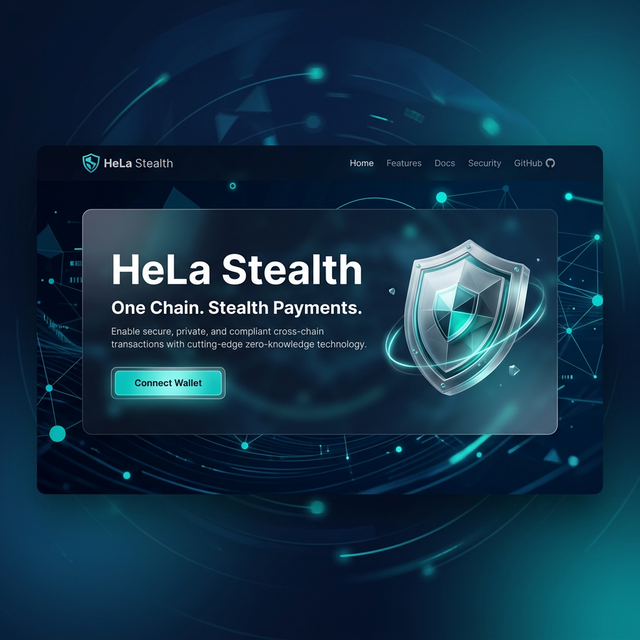
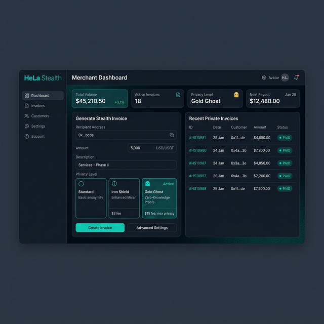

# 🛡️ HeLa Stealth

**Privacy-preserving stablecoin payment gateway on HeLa blockchain.**

HeLa Stealth is a privacy-first stablecoin payment gateway engineered for the **HeLa Blockchain**. It decouples customer-merchant transaction links by leveraging one-time Stealth Vault isolation and anonymous Privacy Pool settlements, ensuring absolute financial privacy for merchants.

🚀 **Live Demo**: [hela-stealth.vercel.app](https://hela-stealth.vercel.app/)  
📺 **Demo Video**: [YouTube](https://youtu.be/IbcwOlAH0rs)



---

## Live Deployment (HeLa Testnet)

The project is fully operational on the **HeLa Testnet**.

### Smart Contracts
| Contract | Address |
|----------|---------|
| **HUSD** | `0xEf3cA15C04e82b90B01AF9EccE1A0C620E74E0b3` |
| **StealthRegistry** | `0x71741409c2F568735748D40F232Be35d43a48661` |
| **FeeManager** | `0xEA5399958B5848eBd835F888f4310e6b7D84B0Fb` |
| **PrivacyPool** | `0x098abE69A28b897d18E998a5F73Fc777e48fe365` |
| **PaymentRouter** | `0x15334Ef0e00F29F5ecCb03D765982F1282B05df8` |

---

## Key Features

1. **HeLa Brand Alignment**: Sleek, professional UI with the HeLa teal palette and glassmorphism.
2. **Stealth Payments**: One-time invoice IDs and stealth vaults protect user privacy.
3. **One-Chain Privacy**: Leverages HeLa's native privacy features on a single, intelligent blockchain.
4. **Seamless UX**: Unified "Connect Wallet" flow and high-impact hero design.



---

## Quick Start (Local Development)

### Prerequisites
- Node.js ≥ 18
- MetaMask browser extension
- HeLa testnet HLUSD

### 1. Install Dependencies
```bash
npm install && cd backend && npm install && cd ../frontend && npm install
```

### 2. Configure & Run
```bash
# Backend
cd backend && cp .env.example .env && npm start

# Frontend
cd frontend && cp .env.example .env && npm run dev
```

---

## Security & Architecture

- **Stealth Address Isolation**: Every invoice deploys a dedicated `StealthVault` contract, ensuring no direct wallet-to-wallet link is ever visible on-chain.
- **Liquidity Shuffling**: Funds are aggregated into a shared `PrivacyPool`, breaking temporal analysis and amount correlation.
- **Obfuscated Settlements**: Merchants claim funds via separate, noise-enhanced transactions, preventing trace-linkability.
- **Native HeLa Integration**: Purpose-built to leverage HeLa's unique privacy-preserving primitives and high-throughput architecture.

---

## 🚀 Roadmap: Advanced Privacy Packets

To mitigate **Amount Correlation Analysis**—where transactional behavior is used to deanonymize large transfers—HeLa Stealth V2 will introduce **Dynamic Packet Splitting**.

### 📦 Privacy Tiers (On-Chain Obfuscation)
Merchants can select a "Privacy Package" with massive randomization ranges and calldata noise:

| Tier | Packet Range | Privacy Level | Security Profile |
| :--- | :--- | :--- | :--- |
| **Standard** | 1 (Fixed) | Basic | ⚡ High Speed |
| **Iron Shield** | 50 – 100 Packets | Enhanced | 🛡️ Secure Mixing |
| **Gold Ghost** | 200 – 500 Packets | Maximum | 👻 Ghost Mode |
| **Infinite Shadow** | 1000+ Packets | Total | 🌌 Absolute Shadow |

### 🛠️ Technical Implementation
1.  **Atomized Deposits**: Large payments are automatically fragmented into hundreds of randomized, non-round amounts.
2.  **Temporal Staggering**: Packet deployment is staggered across multiple blocks to defeat time-based correlation attacks.
3.  **Entropy Injection**: Transactions are padded with custom calldata entropy to mask transaction fingerprints.

---

Built for the **HeLa Hackathon** 🚀
rotocol fee (default 0.00402 HUSD) |

## API Endpoints

| Method | Endpoint | Description |
|--------|----------|-------------|
| `POST` | `/merchant/register` | Register merchant on-chain |
| `POST` | `/invoice/create` | Create payment invoice |
| `GET` | `/invoice/status/:id` | Check invoice status |
| `GET` | `/merchant/invoices/:address` | List merchant invoices |

## Security

- **One-time addresses**: Invoices are single-use, burned after payment
- **Replay protection**: Nonce-based invoice IDs prevent replay attacks
- **ReentrancyGuard**: Payment functions protected against reentrancy
- **Access control**: Mint is owner-only, invoices are merchant-only

## HeLa Chain Config

| Property | Value |
|----------|-------|
| Chain ID | `666888` |
| RPC | `https://testnet-rpc.helachain.com` |
| Explorer | `https://testnet-blockexplorer.helachain.com` |
| Currency | `HLUSD` |

---

Built for hackathon deployment on **HeLa blockchain** 🚀
